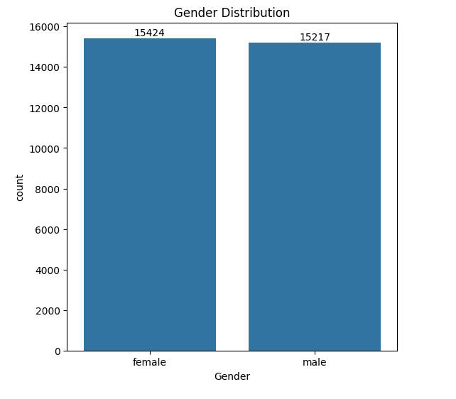
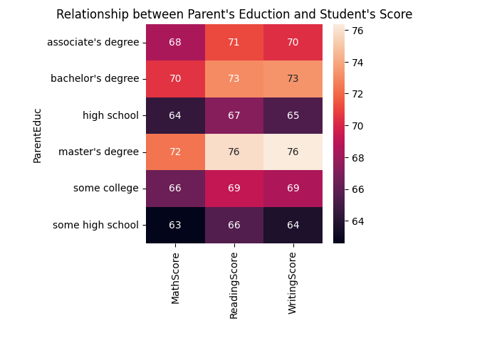
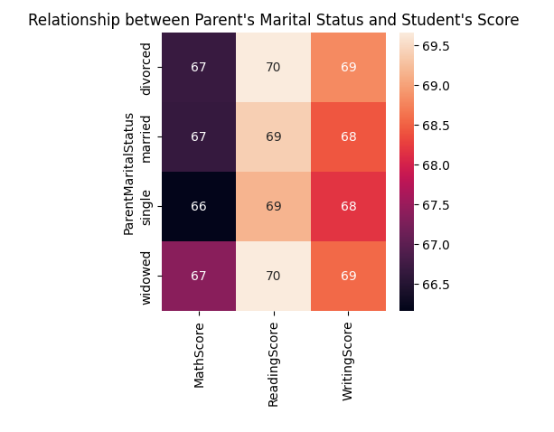
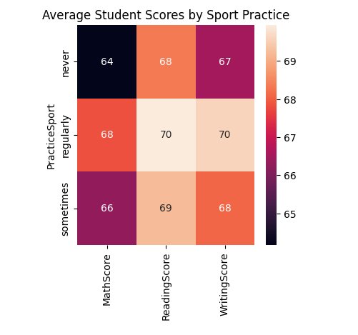

# Student Result Analysis: End-to-End Data Analysis with Python

## Project Overview
This project analyzes student exam scores using the "Students Exam Scores: Extended Dataset" obtained from Kaggle. The primary goal is to uncover how various personal and socio-economic factors influence student performance, providing insights for educators and policymakers to improve educational outcomes.

## Key Features
- **Data Exploration**: Comprehensive analysis of student exam scores, including gender distribution, parental education impact, and socio-economic factors.
- **Data Preprocessing**: Handling missing values, outliers, and normalization to ensure data quality.
- **Statistical Analysis**: Identifying significant factors affecting student performance, such as parental education and dietary habits.
- **Data Visualization**: Clear visual representations of relationships between variables and student outcomes using Matplotlib and Seaborn.
  
## Tools and Technologies
- **Programming Language**: Python
- **Libraries**: Pandas, NumPy, Matplotlib, Seaborn
- **IDE**: Jupyter Notebook
- **Data Source**: Kaggle (Students Exam Scores: Extended Dataset)

## Expected Outcomes
- Insights into factors influencing student performance.
- Recommendations for educators and policymakers to enhance student outcomes.
- Visualization of key trends and relationships within the dataset.

## Getting Started
To run the project locally:
1. Clone the repository:  
   ```bash
   git clone https://github.com/Rushi2810/Student-Result-Analysis.git
2. Navigate to the project directory:
   ```bash
   cd Student-Result-Analysis
3. Open the Jupyter Notebook and run the analysis.


## Data Visualizations

### Gender Distribution
  
*The gender distribution chart indicates that the number of females in the dataset exceeds the number of males. Understanding gender dynamics can be important for tailoring educational strategies and interventions.*

### Parental Education Impact
  
*The chart showing the relationship between parental education and student scores indicates a positive impact of parental education on student performance. This finding suggests that higher levels of parental education are associated with better student outcomes, highlighting the importance of parental involvement in education.*

### Relationship Between Parental Marital Status and Student Scores
  
*The chart illustrates the relationship between parental marital status and student scores, showing no significant impact. This suggests that parental marital status may not be a strong predictor of student performance in this dataset.*

### Impact of Sports Practice
  
*The chart representing the impact of sports practice on student scores indicates a negligible effect. This insight can help educators understand the limited influence of sports participation on academic performance.*

## Acknowledgements

 - [Kaggle for providing the dataset.](https://www.kaggle.com/datasets/desalegngeb/students-exam-scores/data)
 - Open-source community for contributing libraries and resources.
